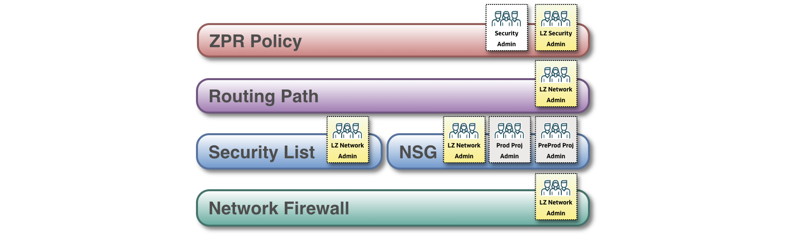
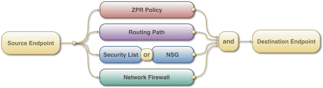
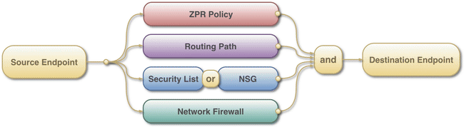
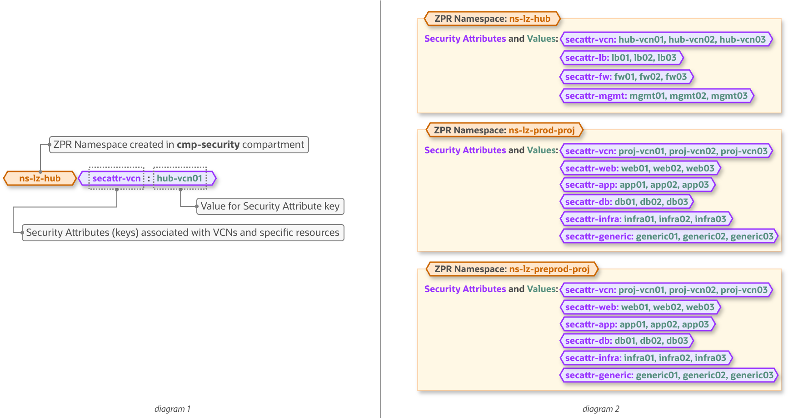
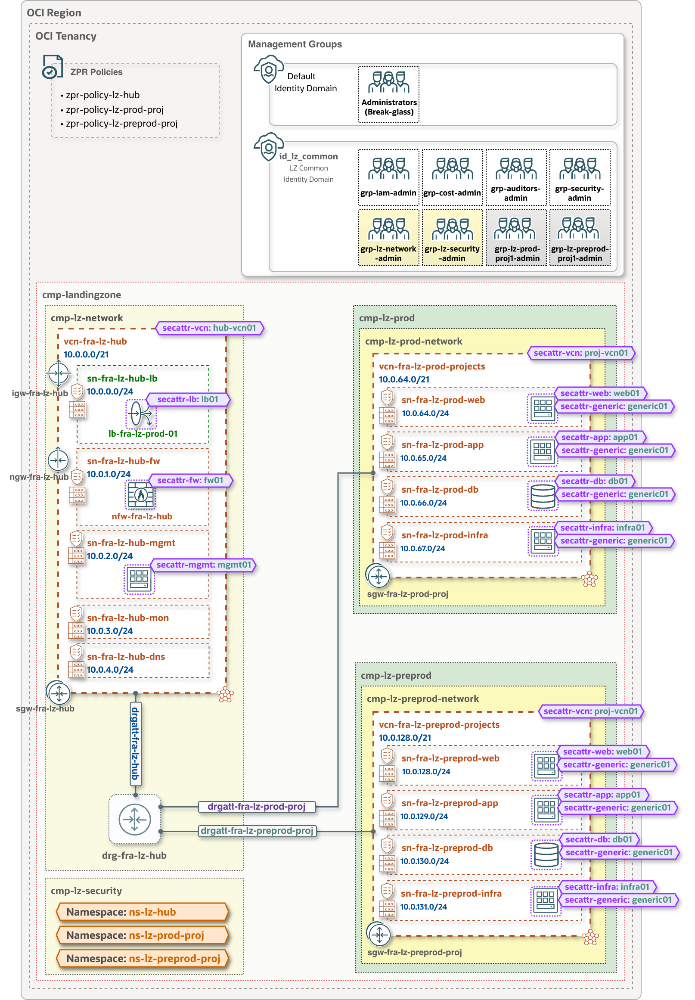
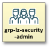
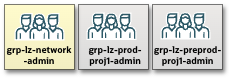

# **[OCI ZPR Addon for Operating Entities Landing Zone](#)**

&nbsp; 

### **Overview**
This addon integrates OCI **Zero Trust Packet Routing (ZPR)** into the One-OE Landing Zone as an additional network security and governance layer.

The One-OE Landing Zone already uses multiple controls to secure network communication, including **routing, Security Lists, Network Security Groups (NSGs), and Network Firewall**. These controls are primarily managed by the Network and Project administration teams.

The ZPR addon complements these existing controls by introducing an independent, **attribute-based policy layer** managed by the Security administration team. This enables the Security team to enforce organization-wide security and compliance requirements without depending on, or replacing, the underlying network configuration.

A key objective of this addon is to provide a clear segregation of duties between the Network, Project, and Security teams. The diagram below shows the IAM groups responsible for managing each network security layer.

- **Network** and **Project** teams manage network connectivity and traditional network security controls, including routing, Security Lists, NSGs, and Network Firewall.

- **Security** teams manage and govern ZPR Security Attribute Namespaces, Security Attributes, and ZPR Policies that define which protected endpoints are permitted to communicate.

!!!! This model allows each team to manage its respective security controls independently while ensuring that network communication is permitted only when all applicable layers allow the traffic.

&nbsp;

For communication between two endpoints to succeed, all applicable network security controls must allow the traffic. **A permissive rule in one layer does not override a more restrictive rule in another layer.**

The animations below illustrate this multi-layer enforcement model.

**First use case - communication allowed:**
The Security team allows communication between the two endpoints through ZPR, while routing, Security Lists or NSGs, and Network Firewall also permit the traffic. Because all applicable controls allow the communication - a logical AND, the destination endpoint can be reached.

&nbsp;

&nbsp;

**Second use case - communication blocked:**
Routing, Security Lists or NSGs, and Network Firewall allow the traffic, but the Security team does not permit the communication through ZPR policies. Because all applicable controls must allow the traffic, the communication is blocked and the destination endpoint cannot be reached.

&nbsp;

&nbsp;

### ZPR addon configuration and structure

A ZPR Security Attribute Namespace is a logical container for a set of related security attributes. Namespaces help organize security attributes and provide a clear administrative boundary for managing and securing them.

A Security Attribute is a label that can be assigned to supported OCI resources and referenced in ZPR policies to control communication between endpoints based on their assigned attributes.

The diagrams below illustrate the ZPR Namespace and Security Attribute structure (*diagram 1*) and the corresponding Namespaces and the Security Attributes they contain (*diagram 2*), as defined in the `oneoe_zpr.json` configuration.

&nbsp;

&nbsp;

The architecture diagram below illustrates the ZPR resources deployed by the ZPR addon as part of the One-OE Landing Zone, including:
- **ZPR Policies**, defined at the tenancy root level.
- **ZPR Namespaces**, each containing its associated Security Attributes and residing in the `cmp-lz-security` compartment.
- **Security Attribute associations**, illustrating how the defined Security Attributes are assigned to Landing Zone workloads and OCI resources.

&nbsp;

> [!NOTE]
> - Although the architecture diagram depicts Security Attributes alongside the workloads to illustrate their association with each resource, the Security Attributes themselves are defined within their respective ZPR Namespaces (see diagram 2) and all reside in the `cmp-lz-security` compartment.
>  - The VM in the management subnet and the workloads shown in the architecture diagram are included for illustration purposes only and are not part of the standard One-OE deployment.

&nbsp;

The ZPR addon provides the following segregation of duties:
| Groups&nbsp;&nbsp;&nbsp;&nbsp;&nbsp;&nbsp;&nbsp;&nbsp;&nbsp;&nbsp;&nbsp;&nbsp;&nbsp;&nbsp;&nbsp;&nbsp;&nbsp;&nbsp;&nbsp;&nbsp;&nbsp;&nbsp;&nbsp;&nbsp;&nbsp;&nbsp;&nbsp;&nbsp;&nbsp;&nbsp;&nbsp;&nbsp;&nbsp;&nbsp;&nbsp;&nbsp;&nbsp;&nbsp;&nbsp;&nbsp;            | Permissions and Scope |
|:-|:-|
|  | **grp-security-admin** provides tenancy-wide administration of ZPR. Members of this group can manage all ZPR Security Attribute Namespaces, Security Attributes, and ZPR Policies in the tenancy, including the creation of new ZPR Policies. |
|  | **grp-lz-security-admin** manages the ZPR Namespaces and Security Attributes created in the `cmp-lz-security` compartment, as well as the ZPR Policies associated with the deployed One-OE Landing Zone. This group does not have permissions to manage other ZPR Policies in the tenancy. Creation of new ZPR Policies must be performed by the **grp-security-admin** group. |
|  | **grp-lz-network-admin**, **grp-lz-prod-proj1-admin** and **grp-lz-preprod-proj1-admin** can associate the relevant Security Attributes with the network resources and workloads they are responsible for managing. These groups do not manage the ZPR Namespaces or ZPR Policies themselves. |

The required IAM groups and permissions to enforce this segregation of duties are defined in `oneoe_iam.json` and are already included in the deployed One-OE Landing Zone.

&nbsp;

### Deployment

&nbsp;

  
&nbsp;

&nbsp;

&nbsp;

&nbsp;

> [!NOTE]

&nbsp;

#### Summary

&nbsp; 

#### License
Copyright (c) 2026 Oracle and/or its affiliates.

Licensed under the Universal Permissive License (UPL), Version 1.0.

See [LICENSE](/LICENSE.txt) for more details.